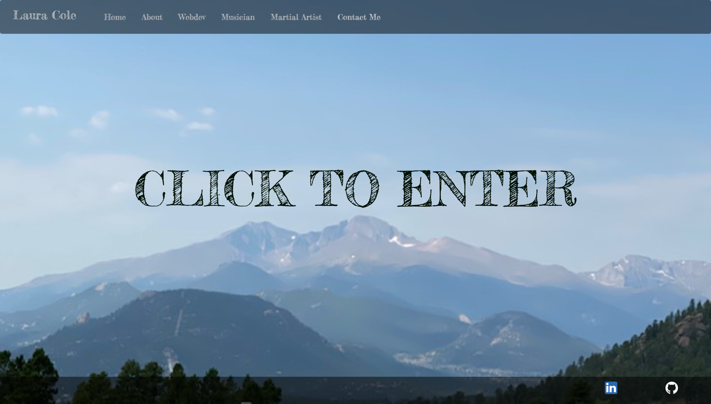
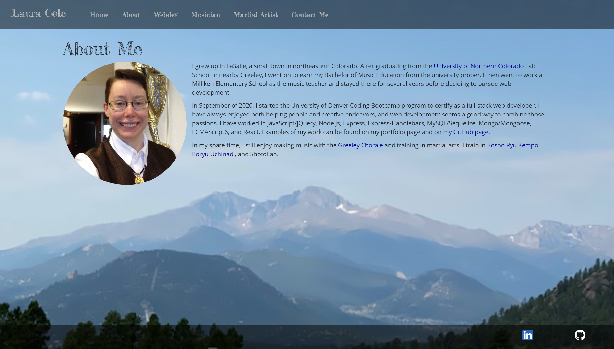
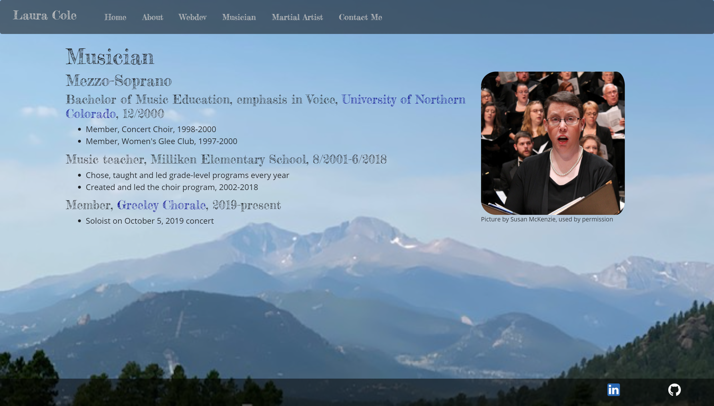
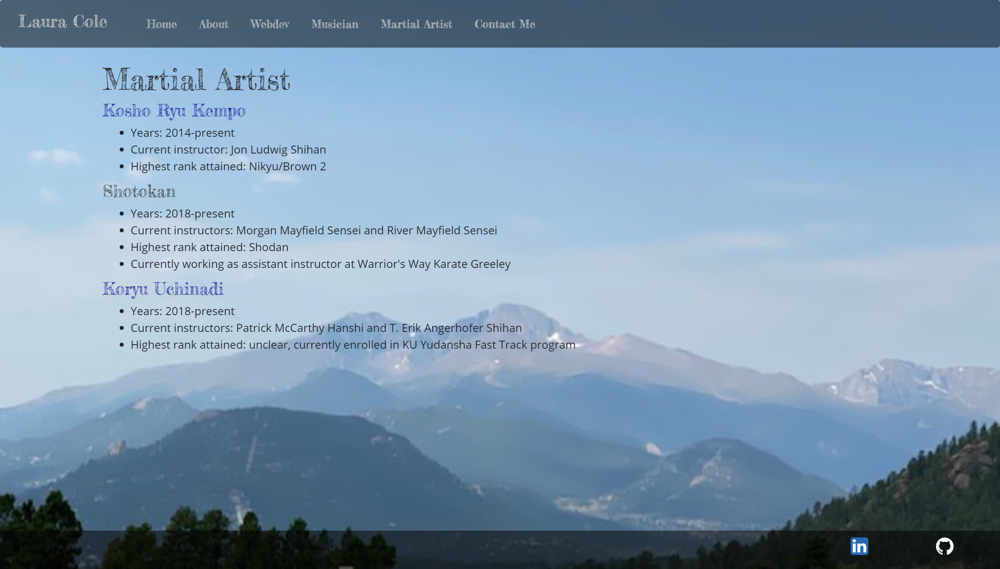
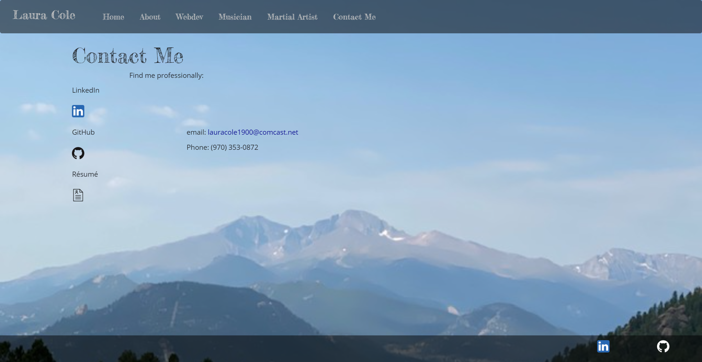

# React Portfolio

## Table of Contents

* [Description](#description)
* [Links](#links)
* [Screenshots](#screenshots)
* [Usage](#usage)
* [Technologies Used](#technologies-used)
* [Tests](#tests)
* [Credits](#credits)
* [Contributing](#contributing)
* [Questions](#questions)
* [Badges](#badges)

## Description

This application uses React to build my portfolio website.

## Links

[Deployed application on GitHub Pages](https://lauracole1900.github.io/react-portfolio/)

## Screenshots

Landing page:

"About" page:

Portfolio page with all project cards showing their fronts:

Portfolio page with some project cards showing their backs:

"Musician" page:

"Martial artist" page:

"Contact Me" page:

## Usage

This project is intended to be used as my website and portfolio.

## Technologies Used

Node.js, React

## Tests

npm run test

## Credits

Landing page animation code provided by [Orkun Tümer](https://codepen.io/tumerorkun) on CodePen

Card animation code provided by [Daniela Schmayev](https://codepen.io/danishyma) on CodePen

## Contributing

N/A

## Questions

If you have further questions, you can reach me at lauracole1900@comcast.net. For more of my work, see [my GitHub](https://github.com/LauraCole1900).

## Badges

 